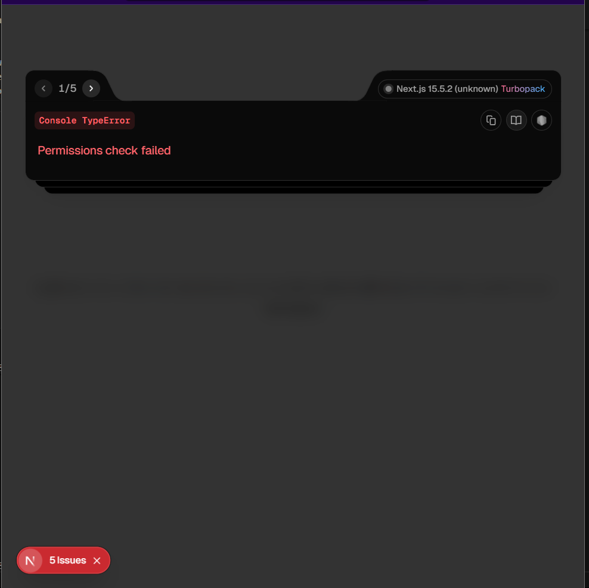

1) During the Share Screen it allows to share the single tab or window(only take the full screen option)

2) permission check during interview fail way to often
3) should automatically shift to full screen when it
4) when i switch the tab and go back it shows the permission check failed

5) When i do screen share first then click on Grant all permissions then it agains ask for screen share

